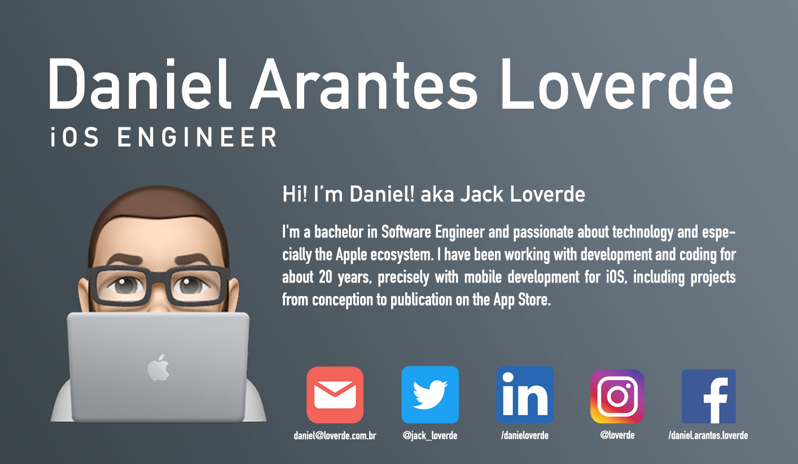

<table>
  <tr>
      <td></td>
      <td></td>
  </tr>   
</table>

<h4 align="left">
  Want know more about me, follow the resume link bellow:
</h4>

🔗 <a href="https://github.com/loverde-co/resume">https://github.com/loverde-co/resume</a>

<h5 align="left">
  📌  Living in <b>Aguaí</b>, <b>São Paulo</b>, <b>Brazil</b>  
</h5>
<h5 align="left">💻 Swift | CocoaPods | SwiftUI | Git | CoreML | SwiftLint </h5>

<h5 align="left">💼 Currenty working with iOS Development at Go.K </h5>